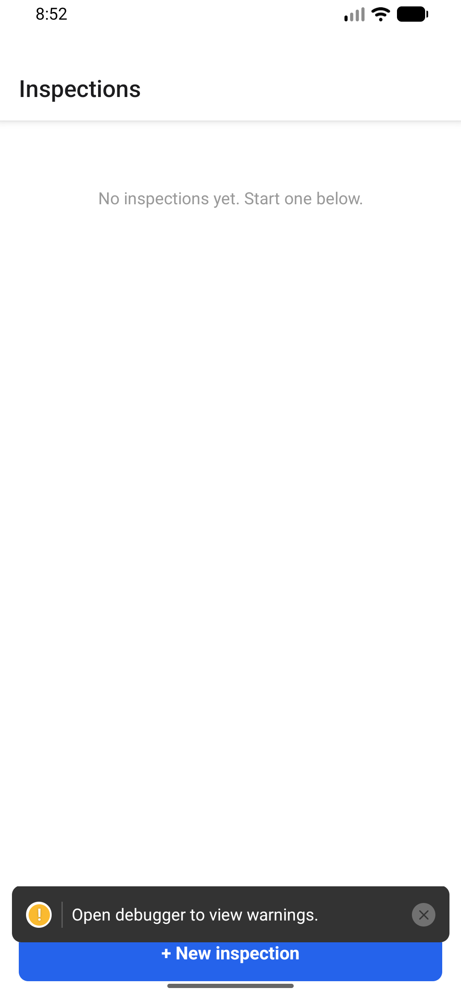
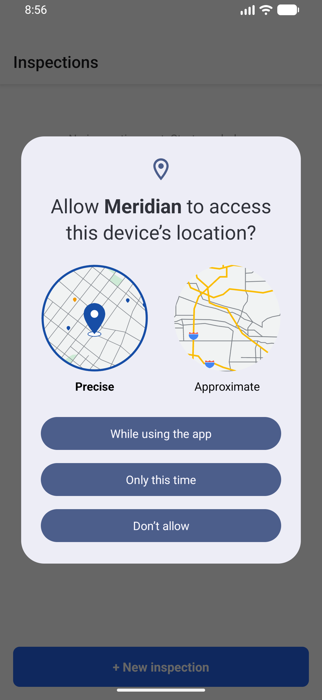
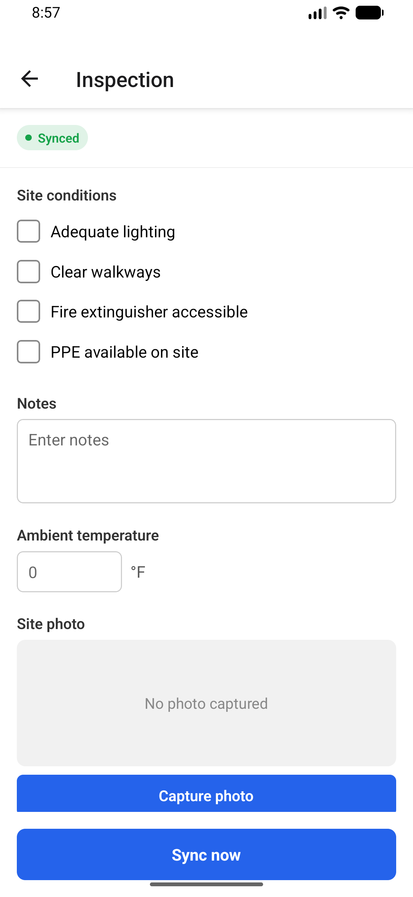
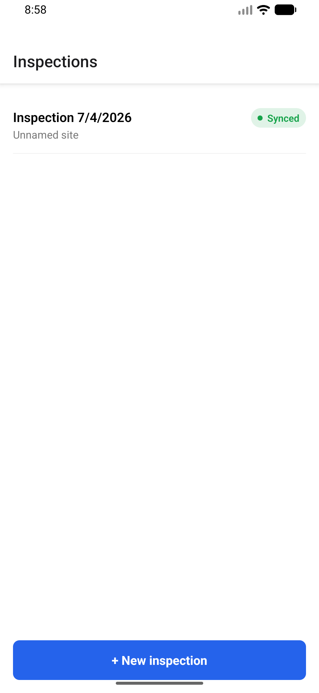

# Meridian

Offline-first field inspection app for React Native. Field technicians
complete structured inspections — checklists, notes, photos, signatures —
with zero connectivity, and when two techs have edited the same record
offline, the app merges their changes without silently dropping either
person's work.

This is not a CRUD app with an "offline mode" bolted on. The actual
engineering problem it's built to answer is: **what happens when two
offline clients edit the same record, and how do you resolve that without
a server round-trip at edit time.**

## Screenshots

Captured live on an Android emulator (API 36, arm64) via `adb`, not mocked:

| | | |
|---|---|---|
|  |  |  |
| 1. Empty list | 2. Native GPS permission prompt on inspection creation | 3. The schema-driven form renderer — checklist, text, numeric, photo, signature, all from one `FormSchema` |



4. Back on the list screen with zero manual refresh — WatermelonDB's `observe()` pushed the new record straight through `useInspections()` the moment it was written.

## 1. Problem

The obvious approach — timestamp every record, last-write-wins on sync —
is wrong for this use case, and it fails in a way that's easy to miss in a
demo and painful in production: it doesn't fail loudly, it fails *quietly*.
Two inspectors cover the same site on different shifts. Both go offline.
Inspector A notes a valve reading. Inspector B, working from a stale local
copy, edits the site notes on the same record. Whoever syncs second wins —
and the other inspector's write vanishes with no error, no prompt, nothing
in the UI to suggest it ever happened. In a compliance/safety-inspection
context, a silently dropped observation isn't a UX papercut, it's the kind
of bug that shows up in an incident report.

The bar this app is built to clear: **different fields edited concurrently
must merge automatically and correctly; the same field edited concurrently
must be surfaced to a human, never dropped.**

## 2. Architecture decision

**CRDT (Yjs) over Operational Transformation, and over per-field last-write-wins.**

- OT requires a central server to sequence operations and is built for
  real-time collaborative editing (think Google Docs) — it's the wrong
  tool for "two devices that may not talk to each other for days."
- Naive per-field last-write-wins (compare `updatedAt` timestamps) *looks*
  like it solves the same-field case, but it has the same silent-drop
  problem one level down: whichever write has the later clock value wins,
  full stop, and the loser's edit is gone with no record it ever existed.
  It also assumes clocks are trustworthy, which they aren't across
  real devices.
- Yjs gives deterministic, mathematically-sound convergence for free (every
  device that's seen the same set of updates arrives at the same state,
  regardless of what order they arrived in) — but on its own it has the
  *exact same* silent-drop problem as naive LWW for same-key writes: it
  picks a winner and moves on. The actual work in this app is the layer on
  top of Yjs (`src/sync/conflictDetector.ts`) that watches for exactly the
  moment a device's own pending edit gets overwritten by that resolution,
  and turns it into a flagged, user-facing conflict instead of letting it
  disappear. See `src/sync/syncClient.ts` for the full explanation of why
  this has to persist *across* sync rounds, not just within one.

**WatermelonDB over Realm/plain SQLite.**

WatermelonDB is reactive (screens re-render automatically when a query's
underlying data changes — see `src/db/hooks.ts`) and is JSI-backed, so
local reads/writes never cross the old async bridge. Realm is a comparable
choice technically; WatermelonDB was picked for its simpler mental model
around per-record Model classes and lazy queries, which maps cleanly onto
"one Yjs doc per inspection, one row per inspection."

**Bare React Native CLI, New Architecture (Fabric/TurboModules) on.**
No Expo — the sync engine and photo/GPS capture don't need it, and staying
bare avoids an abstraction layer between this code and the native modules
it depends on (WatermelonDB's SQLite adapter, background-fetch).

**No Redux/Recoil/Context for app state — the reactive database *is* the
state layer.** This is the first of five deliberately different state
setups across my portfolio apps (the others reach for Redux Toolkit,
Recoil, or plain Context depending on what each app's state actually
looks like — see each repo's own README). Here, every screen reads
directly off WatermelonDB's `observe()` queries (`src/db/hooks.ts`); there
is no separate client-state cache to keep in sync with the database,
because for an offline-first app the database's reactivity already gives
you exactly that. Introducing Redux/Recoil on top would mean maintaining
two sources of truth for the same data — the wrong trade-off for this
specific app, even though it's the right one for some of the others.

## 3. A real bug this project's test suite caught

While writing the two-offline-clients merge test
(`__tests__/sync/merge.test.ts`), the first implementation of the conflict
watcher passed on some runs and failed on others — flaky in a way that
tracked with Yjs's internally-random client IDs, which was the tell that
something was order-dependent rather than logically wrong.

The bug: a field was marked "no longer watched for conflicts" as soon as
one sync round completed, even if that round completed *before* the other
device had pushed anything. Two offline clients don't push in lockstep —
if device A syncs first (nothing to conflict with yet, so no conflict is
reported — correctly, at that moment) and stops watching that field, then
device B's conflicting edit arrives on a *later* round, A has no way left
to notice its own edit just got silently overwritten. The fix
(`src/sync/syncClient.ts`, `src/sync/syncEngine.ts`) is to keep a field
"pending" until a write from a *different* device has actually been
observed for it — not just until one round trip has happened. Running the
suite 15 times back to back after the fix (0 failures) is what convinced
me it was actually fixed and not just less likely to reproduce.

This is exactly the kind of bug the spec's testing guidance was pointing
at, and it's the main reason the merge test suite is the highest-value
artifact in this repo, not a checkbox.

## 4. Trade-offs

- **CRDT storage overhead.** Every inspection carries its full Yjs
  document state (`crdt_state` column), not just its current field
  values. For a form with a handful of fields this is negligible; it
  would need attention (e.g. periodic snapshot + log compaction) at much
  larger field counts or edit-history depth than this app's use case
  produces.
- **No visual form builder.** "Dynamic form renderer" here means the
  renderer (`src/forms/FormRenderer.tsx`) is fully schema-driven — swap in
  a different `FormSchema` and no renderer code changes — but there's no
  drag-and-drop UI to *author* that schema. Building one was out of scope
  for the time budget; the form template lives in
  `src/forms/templates/safetyInspectionTemplate.ts` as a plain data file.
- **Composite field values are single conflict units.** Checklist
  selections and signatures serialize to one string value each
  (`ChecklistField.tsx`, `SignatureField.tsx`). A concurrent edit to a
  checklist is one conflict on the whole checklist, not one per checkbox.
  Modeling each checkbox as its own CRDT key was possible but added
  complexity disproportionate to the value for this MVP.
- **Minimal backend is in-memory, single-process.** `src/mock-backend/fakeSyncServer.ts`
  stands in for "a real Node/Express or Supabase endpoint that stores the
  same shape of data" (spec section 6) — `src/sync/backend.ts` is the one
  file a real deployment would need to change; nothing else in the sync
  engine talks to it directly.
- **Photo upload isn't implemented**, only tracked. `src/photos/photoStorage.ts`
  records captured photos with an `uploaded` flag for the background sync
  engine to act on; the actual "PUT to an S3 presigned URL" half needs a
  real backend to presign against, which is out of scope here.
- **No Detox/Maestro E2E suite.** Given the time budget, effort went into
  the unit/integration test suite for the merge logic instead (spec
  section 9 calls this "the highest-value test suite in the whole app" —
  taken literally here). A `Detox` or `Maestro` flow for "fill form →
  kill app → relaunch → data persisted" is the natural next addition.

## 5. What's verified vs. not, in this environment

Verified directly, in this pass:

- `npx tsc --noEmit` — clean, zero errors.
- `npx eslint .` — clean.
- `npx jest` — 4/4 tests passing, including the merge suite run 15
  consecutive times with zero flakiness after the fix in §3.
- `pod install` — all 87 pods (WatermelonDB, Yjs's native random-values
  polyfill path, react-navigation, background-fetch, geolocation,
  image-picker, svg) resolve and install cleanly.
- **`./gradlew assembleDebug` succeeds** (`BUILD SUCCESSFUL`, New
  Architecture on) and **the APK was installed, launched, and driven on a
  real Android emulator via `adb`** — not just built. That run caught and
  fixed a real bug: `react-native-background-fetch`'s job scheduler throws
  a `SecurityException` without `android.permission.ACCESS_NETWORK_STATE`
  in the manifest (it was missing; see `AndroidManifest.xml`). The
  screenshots above (empty list → create → dynamic form renders → list
  reactively updates) were captured from that live run using `adb shell
  input tap` and `adb exec-out screencap`, not a simulator/mock.
- A real `xcodebuild` Debug build for `iphonesimulator` also succeeds
  (`BUILD SUCCEEDED`) and was installed and launched on a booted iOS 26
  simulator, confirming the codebase isn't Android-only. Per this
  project's verification policy, Android is the platform used for the
  actual interactive walkthrough (its `adb`-based automation made that
  possible without extra tooling); iOS verification stopped at "boots and
  renders," which it does.

Not verified in this pass:

- The rest of the flow beyond what's in the screenshots above — photo
  capture (needs a real camera, not an emulator's virtual scene),
  signature drawing, sync-conflict resolution with a second simulated
  device sharing the same backend instance, submitting/completing an
  inspection. The merge/conflict logic itself already has direct
  automated test coverage (§3), which is stronger evidence for the part
  of the app that actually matters than more manual tapping would add.
- The spec's performance targets (50 pending records + photos syncing
  without UI-perceived blocking; behavior under 20% simulated packet
  loss via Charles Proxy / Network Link Conditioner) — these need a real
  device and real network-conditioning tools, not an emulator.
- A recorded demo/GIF of two physical offline devices editing the same
  record and merging on reconnect (spec's suggested "Metric" artifact) —
  the equivalent automated proof is the merge test suite in §3.

## 6. Project structure

```
src/
  db/            WatermelonDB schema, models, reactive query hooks
  forms/         Schema-driven form renderer + field components
  sync/          The CRDT engine: crdtDoc, conflictDetector, syncClient
                 (pure, tested), syncEngine (WatermelonDB-wired), backend
  mock-backend/  In-memory stand-in for a real sync server
  photos/        Deferred-upload photo tracking
  location/      One-shot GPS capture per inspection
  screens/       Inspection list, form, conflict resolution
  navigation/    React Navigation stack
  polyfills/     Metro/Jest webcrypto shim (see file for why)
__tests__/
  sync/merge.test.ts   The highest-value test in the repo — see §3
```

## 7. Running it

```bash
npm install
cd ios && bundle install && bundle exec pod install && cd ..
npx react-native run-ios      # or run-android
```

Run the test suite:

```bash
npx jest
npx tsc --noEmit
npx eslint .
```
